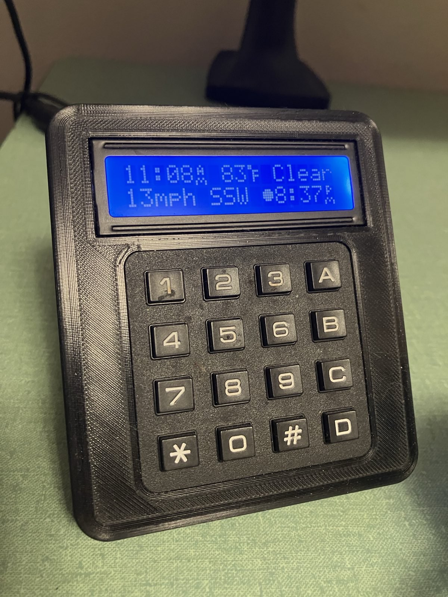

# Control Pad

Breaks out monitor controls into a desktop based keypad. Also runs a simple webserver on port 1602 to display text on
the screen from api requests.


## Hardware

### Parts List

- [3D Printed Enclosure](3d_models/enclosure.3mf)
- Raspberry Pi Zero W
- [16x2 HD44780 LCD Display](https://www.adafruit.com/product/181)
- [4x4 Matrix Keypad](https://www.adafruit.com/product/3844)
- 10K Trimpot
- Female/Female Jumper Wires
- Micro USB Cable for power
- Mini HDMI Cable
- 4x M3x12 bolts
- 4x 10mm self adhesive rubber feet

### Assembly

See Adafruit's guides to wiring the
[display](https://learn.adafruit.com/drive-a-16x2-lcd-directly-with-a-raspberry-pi/wiring)
and
[keypad](https://learn.adafruit.com/matrix-keypad/python-circuitpython#python-computer-wiring-2998508).\
The pins on the lcd and display must be bent ~45° in order for them to fit inside the case.\
The protrusions in the 3d model sized for a ~18mm cylinder are to hold a chunk of steel to give it some extra weight.


## Software

### Prerequisites

Controlling the monitor relies on the DDC/CI protocol.
This is done over the `/dev/i2c-2` interface which is disabled by default.
See [ddcutil's documentation](https://www.ddcutil.com/raspberry/) for details.
Enabling this requires adding a line to config.txt and a reboot.

```bash
echo "dtparam=i2c2_iknowwhatimdoing" | sudo tee -a /boot/firmware/config.txt
sudo reboot now
```

From a fresh Pi OS Lite image, ddcutil, pip and git are required.

```
sudo apt install ddcutil python3-pip git -y
```

### Installation

```bash
git clone https://github.com/ChunkLightTuna/monitor_control.git
cd monitor_control
python -m venv .venv
. .venv/bin/activate
pip install -r requirements.txt
```

### Config

Pin mappings are defined in [pinout.json](pinout.json). Note these are by GPIO/BCM number, not their physical position.
If you wire your pi up differently adjust the json accordingly.

Monitor IDs to be used under `displays` can be retrieved using the following `ddcutil` command:

```
ddcutil capabilities |  awk  '/Feature: 60/{f=1; next} f&&!/Feature/{print} /Feature/{f=0}'
```

Displaying weather forecast requires the [`OPEN_WEATHER_API_KEY`](https://home.openweathermap.org/users/sign_up), `LAT`
and `LONG` environment variables be set.
These may be defined in [monitor_control.service](monitor_control.sample.service). Port number may be modified from the
service file as well.



### Running
`uvicorn main:app --host 0.0.0.0` will run the app. 
From the initial screen press `2` or `8` to go to the Monitor Control menu.    
Pressing `A`, entering a number, and then `#` will set your display's audio level. \
`B` will do the same for brightness.
`C` will select the previous display, and `D` the next.

To persist as a systemd service, run the following: 
```bash
sed -e "s/\${DIR}/$(pwd | sed 's|/|\\\/|g')\/src/g" monitor_control.sample.service > monitor_control.service
systemctl enable --now "$(pwd)/monitor_control.service"
```


