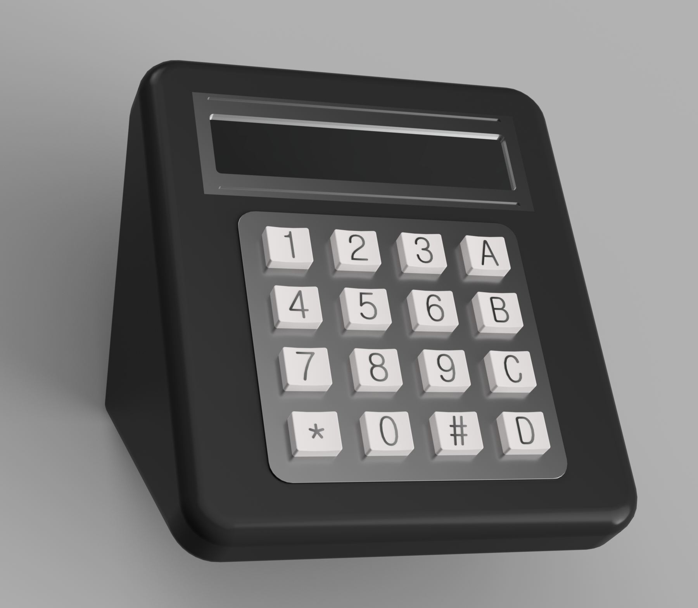
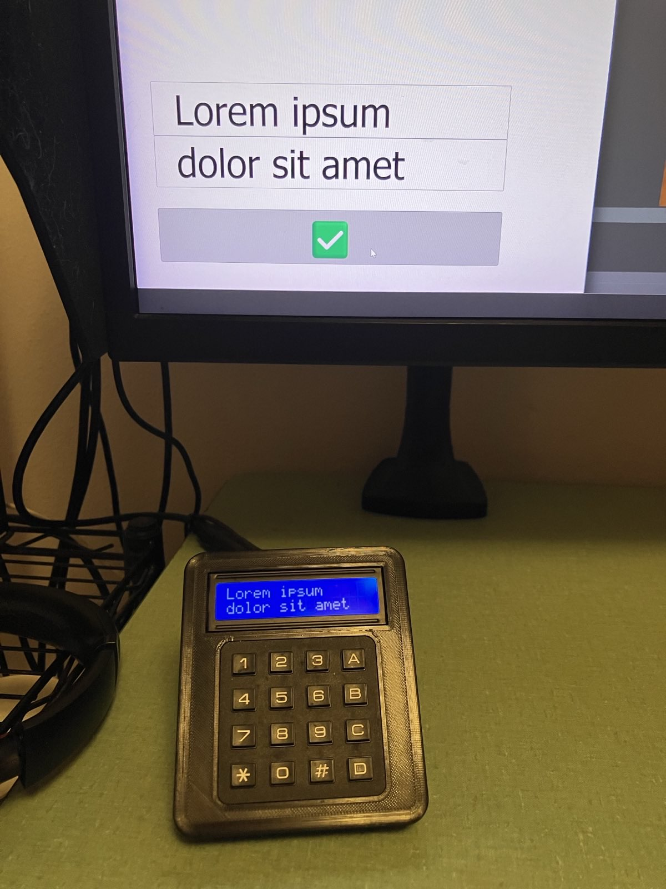

# Control Pad

Breaks out monitor controls into a desktop based keypad. Also runs a simple webserver on port 1602 to display text on
the screen from api requests.



## Parts List

- Raspberry Pi Zero W
- 1602 16x2 HD44780
- 4x4 Matrix Keypad
- 10K Trimpot
- Female/Female Jumper Wires
- Micro USB Cable
- Mini HDMI Cable

## Wiring

See Adafruit's guides to wiring
the [display](https://learn.adafruit.com/drive-a-16x2-lcd-directly-with-a-raspberry-pi/wiring) and
[keypad](https://learn.adafruit.com/matrix-keypad/python-circuitpython#python-computer-wiring-2998508).

## Prerequisites

Controlling the monitor relies on the DDC/CI protocol.
This is done over the `/dev/i2c-2` interface which is disabled by default.
See [ddcutil's documentation](https://www.ddcutil.com/raspberry/) for details.
Enabling this requires adding a line to config.txt and a reboot.

```bash
echo "dtparam=i2c2_iknowwhatimdoing" | sudo tee -a /boot/firmware/config.txt
sudo reboot now
```

From a fresh Pi OS Lite image, ddcutil, pip and git are required.

```
sudo apt install ddcutil python3-pip git -y
```

Pin mappings are defined in [pinout.json](pinout.json). Note these are by GPIO/BCM number, not their physical position.
If you wire your pi up differently adjust the json accordingly.

Monitor IDs to be used under `displays` can be retrieved using the following `ddcutil` command:

```
ddcutil capabilities | awk '/Feature: 60 \(Input Source\)/{p=1} /^ Feature: 62/{p=0} p'
```

## Installation

```bash
git clone https://github.com/ChunkLightTuna/monitor_control.git
cd monitor_control
python -m venv venv
source venv/bin/activate
pip install -r requirements.txt
sed -e "s/\${DIR}/$(pwd | sed 's|/|\\\/|g')/g" monitor_control.sample.service > monitor_control.service
systemctl enable --now "$(pwd)/monitor_control.service"
```

By default the webserver runs on port 1602. This can be changed in `monitor_control.service`.
